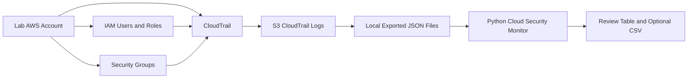

# AWS Architecture Diagram

This is the simple lab architecture for the project.

Plain-English explanation:

CloudTrail records activity in the lab AWS account. The logs can be exported or downloaded as JSON files. The Python monitor reads those local files and flags predefined events for review, such as IAM changes, failed sign-ins, access-key changes, security-group updates, and CloudTrail administrative actions.

